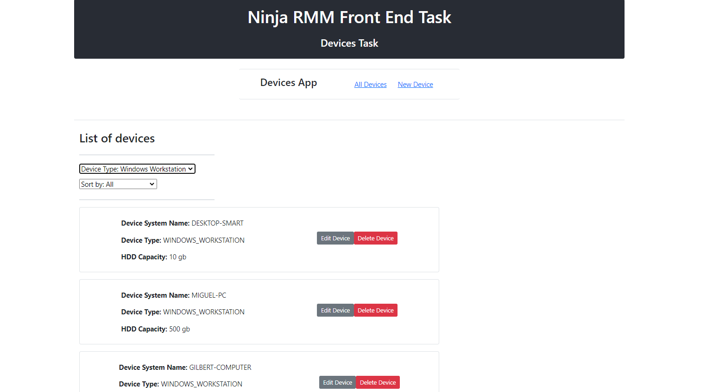
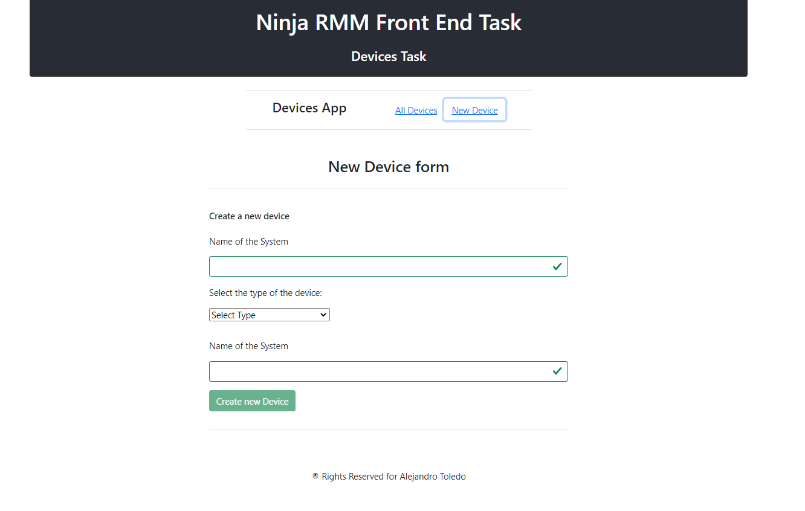

# Frontend task for NinjaRMM

This project is part of the process for a job application in NinjaRMM. The project is based on a Back End Rest API project that contains a list of devices and I must work with those devices on Front End using React JS.
The project allows the user to implement the GET, POST, PUT and DELETE methods with the API data.

## Walk Through the Project

The home view contains the list of devices. Automatically the GET method is called to obtain all the devices listed on the home page.
Each Device has the following attributes:

- System_name
- Type
- HDD Capacity

And for each device, there are two buttons, one for edit the information (PUT METHOD) and one to delete the device (DELETE METHOD).

When you `click` on the `Edit` button a Modal Form will prompt allowing the user to update the information of the devices. The information of the device selected is prefilled on the form. Then you can `click` the button of `Save Changes` to save the current changes made on the form or to `click` the `Close` button in order to return to the home view with any modifications made on the device selected.

There is a link button in the navbar to `New Device`. This link will show the new device form that allows the user to create a new device with the 3 attributes mentioned before.

Also, on the Home page, you can filter the list of devices based on their type, and you can sort the list of devices based on the system_name or in the HDD capacity from lowest to highest.

## Built With

- JavaScript
- React JS

## Getting Started

To get a local copy up and follow these simple example steps.

### Prerequisites

- Local Machine installed [Nodejs](https://nodejs.org/en/download/)
- Yarn as a package manager
- A code editor as [Visual Studio](https://code.visualstudio.com/download), Sublime,etc.

### Setup

- Please make a local copy of this repo by typing this command on your terminal.

`git clone git@github.com:alejandrotoledoweb/devices-clientapp.git`

- Then, go to the folder created with:

`cd devices-clientapp`

## Available Scripts

In the project directory, you can run:

### `yarn start`

Before running this command be sure to run `npm i` to install all dependencies.

Runs the app in the development mode.\
Open [http://localhost:3001](http://localhost:3001) to view it in the browser.

The page will reload if you make edits.\
You will also see any lint errors in the console.

### `yarn build`

Builds the app for production to the `build` folder.\
It correctly bundles React in production mode and optimizes the build for the best performance.

The build is minified and the filenames include the hashes.\
Your app is ready to be deployed!

See the section about [deployment](https://facebook.github.io/create-react-app/docs/deployment) for more information.

### `yarn eject`

**Note: this is a one-way operation. Once you `eject`, you can’t go back!**

If you aren’t satisfied with the build tool and configuration choices, you can `eject` at any time. This command will remove the single build dependency from your project.

Instead, it will copy all the configuration files and the transitive dependencies (webpack, Babel, ESLint, etc) right into your project so you have full control over them. All of the commands except `eject` will still work, but they will point to the copied scripts so you can tweak them. At this point, you’re on your own.

You don’t have to ever use `eject`. The curated feature set is suitable for small and middle deployments, and you shouldn’t feel obligated to use this feature. However, we understand that this tool wouldn’t be useful if you couldn’t customize it when you are ready for it.

## Authors

👤  **Alejandro Toledo**

- GitHub: [@alejandrotoledoweb](https://github.com/alejandrotoledoweb)
- Twitter: [@alejot](https://twitter.com/alejot)
- LinkedIn: [Alejandro Toledo](https://www.linkedin.com/in/alejandro-toledo-freire/)

## 🤝 Contributing

Contributions, issues, and feature requests are welcome!

Feel free to check the [issues page](https://github.com/alejandrotoledoweb/devices-clientapp/issues).

## Show your support

Give a ⭐️ if you like this project!

## Acknowledgments

- Thank you to Ninja RMM, who challenged me to build this app.

## 📝 License

This project is [MIT](lic.url) licensed.
This project was bootstrapped with [Create React App](https://github.com/facebook/create-react-app).
